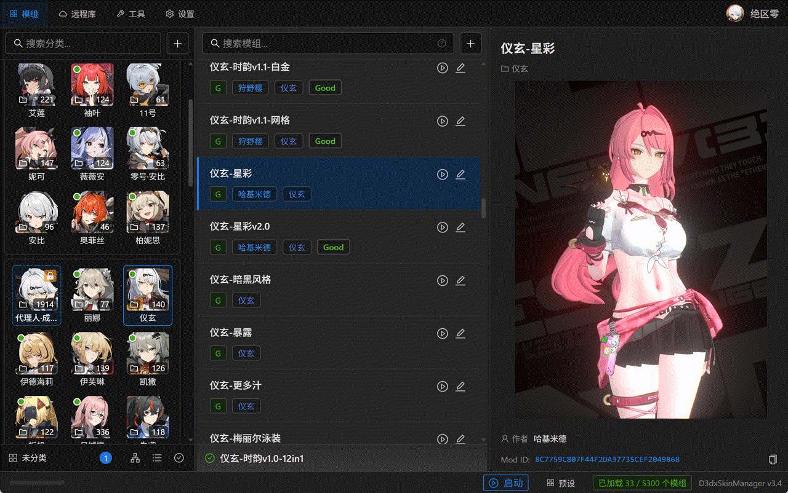
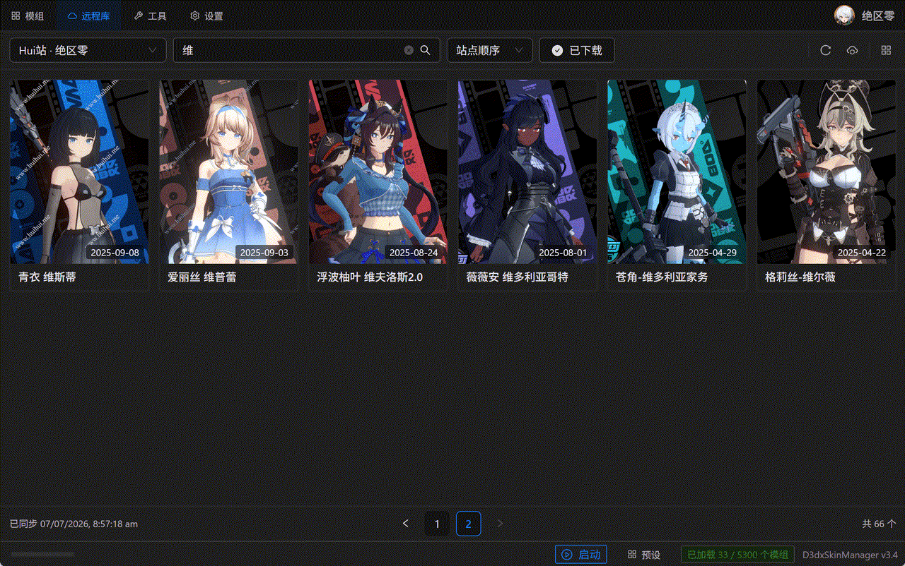

# D3dxSkinManager

**English** · [简体中文](README.cn.md)

**A mod manager for 3DMigoto / XXMI game modding — collect, organize, fix and deploy your mods.**

Keep your whole mod collection in one tidy, compressed library. Turn mods on and off with a click, fix them after game updates, download new ones from mod sites, and launch the game — the app puts the right files where XXMI expects them.

> Works **alongside XXMI** (GIMI / ZZMI / SRMI / WWMI / HIMI / EFMI). XXMI does the in‑game injection and launch; this app is the library and workshop around it.

---

## 📥 Download & Install

**[⬇️ Download the latest version](https://github.com/JiarongGu/D3dxSkinManager/releases/latest)** (Windows x64)

1. Download the ZIP from [Releases](https://github.com/JiarongGu/D3dxSkinManager/releases/latest).
2. Extract it to any folder.
3. Run **`D3dxSkinManager.exe`** (the launcher installs the .NET 10 runtime automatically if needed).

**Requirements:** Windows 10/11 (64‑bit).

---

## 📖 User Guide

New here? The full guide walks you through setup and every feature, with step‑by‑step examples:

- **[User Guide (English)](docs/user-guide/USER_GUIDE.en.md)**
- **[使用指南（中文）](docs/user-guide/USER_GUIDE.cn.md)**

The same guide is built into the app — click the version label in the bottom‑right to open **Help & Documentation**.

---

## ✨ Features

- 📦 **Import** — drag & drop `.zip` / `.7z` / `.rar` archives or folders; everything is normalized into a compact library.
- 🗂️ **Organize** — hierarchical categories, custom tags, and powerful search.
- ⚡ **One‑click load / unload** — deploys the mod into XXMI's `Mods` folder; only one mod per category is active at a time.
- 🌐 **Remote Library** — browse and download mods from sites (**Hui站**, **GameBanana**) without leaving the app.
- 🛠️ **Fix after updates** — re‑fix mod hashes when a game updates, with a built‑in health **Analysis** scan.
- 🔗 **Merge & optimize** — combine same‑character variants under one **swap key**; de‑duplicate files to save space.
- ⌨️ **Keybinding & config editor** — rebind toggle keys (keyboard + controller) and tweak a mod's safe settings.
- 🖼️ **Previews & presets** — browse mod screenshots; save and restore whole loadouts.
- 🎮 **XXMI launch** — one‑click launch through XXMI; a separate profile per game.
- ☁️ **Online storage** — sign in to download hosts (Quark) in‑app.
- 🌏 **English & 中文.**

---

## 🎮 Supported Games

Any game supported by an **XXMI** importer:

- Genshin Impact (GIMI)
- Zenless Zone Zero (ZZMI)
- Honkai: Star Rail (SRMI)
- Wuthering Waves (WWMI)
- Honkai Impact 3rd (HIMI)
- Endfield (EFMI)

> You'll set up **XXMI** separately (it loads mods into the game). This app manages and deploys your mod library, and can launch the game through XXMI for you.

---

## 🆘 Need Help?

- **[📖 User Guide](docs/user-guide/USER_GUIDE.en.md)** — how to use every feature
- **[📝 Changelog](CHANGELOG.md)** — what's new
- **[🐛 Report a bug / 💡 request a feature](https://github.com/JiarongGu/D3dxSkinManager/issues)**

---

## 🔧 For Developers

Building from source, architecture and contributor docs live in the **[docs folder](docs/)** — start with the **[Development Guide](docs/core/DEVELOPMENT.md)** and the **[AI Guide](docs/AI_GUIDE.md)**.

Built with .NET 10 + WinForms + WebView2 (backend) and React 19 + TypeScript + Vite (frontend).

---

## License

Released under the [MIT License](LICENSE). © D3dxSkinManager contributors.
