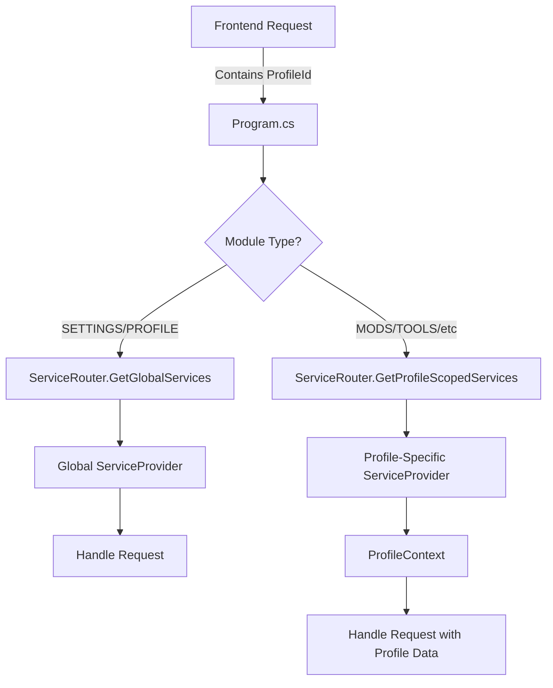

# Stateless Service Architecture

## Overview

D3dxSkinManager uses a **stateless API architecture** where each request contains all necessary context (including profile ID). There is no concept of an "active profile" - the system routes each request to the appropriate service provider based on whether ProfileContext is needed.

## Key Concepts

### Stateless Design
- **No Active Profile**: Profile ID comes from each request
- **Request Routing**: Services are selected based on module type and profile ID
- **Service Isolation**: Each profile gets its own service provider, but selection is per-request

### Service Categories

1. **Global Services** (No ProfileContext needed)
   - ProfileServiceProvider (profile CRUD)
   - GlobalSettingsService
   - System-level operations

2. **Profile-Scoped Services** (Require ProfileContext)
   - ModFacade, ModRepository, ModFileService
   - MigrationService, ToolsServices
   - Any service that operates on profile-specific data

## Architecture Components

### 1. ServiceRouter (Root Level)
**Location**: `D3dxSkinManager/ServiceRouter.cs`

**Purpose**: Routes stateless API requests to appropriate service providers

**Responsibilities**:
- Determines if request needs ProfileContext
- Routes to global or profile-scoped services
- Caches service providers for efficiency
- Manages service lifecycle

**Key Methods**:
```csharp
// Get global services (no ProfileContext)
GetGlobalServices()

// Get profile-scoped services (with ProfileContext)
GetProfileScopedServices(string profileId)

// Route request based on module type
RouteRequest(string module, string? profileId)
```

### 2. ProfileServiceProvider (Module Level)
**Location**: `D3dxSkinManager/Modules/Profiles/Services/ProfileServiceProvider.cs`

**Purpose**: Manages profile CRUD operations (stateless)

**Responsibilities**:
- Profile creation, update, deletion
- Profile metadata management
- No "active profile" concept
- Profile listing and queries

**Key Changes for Stateless**:
- `GetActiveProfileAsync()` returns null (no active profile)
- `SwitchProfileAsync()` just validates and updates timestamp
- No `_activeProfileId` field
- Profile ID always comes from request

### 3. ProfileContext (Module Level)
**Location**: `D3dxSkinManager/Modules/Profiles/ProfileContext.cs`

**Purpose**: Provides profile-specific paths to services

**Usage**: Injected into services that need profile-specific data paths

## Request Flow



## Implementation Example

### In Program.cs (IPC Handler)
```csharp
// Parse request with module and profileId
var request = JsonSerializer.Deserialize<MessageRequest>(message);

// Route to appropriate service provider
var serviceProvider = _serviceRouter?.RouteRequest(
    request.Module,     // e.g., "MOD", "SETTINGS", "PROFILE"
    request.ProfileId   // Profile ID from request (can be null)
);

// Get the module router from the service provider
var moduleRouter = serviceProvider?.GetService<IModuleRouter>();

// Handle the request
var response = await moduleRouter.HandleMessageAsync(request);
```

### ServiceRouter Logic
```csharp
public IServiceProvider RouteRequest(string module, string? profileId)
{
    // Global modules don't need ProfileContext
    var globalModules = new[] { "SETTINGS", "PROFILE", "SYSTEM" };

    if (globalModules.Contains(module?.ToUpperInvariant()))
    {
        return GetGlobalServices();  // No ProfileContext
    }
    else if (!string.IsNullOrEmpty(profileId))
    {
        return GetProfileScopedServices(profileId);  // With ProfileContext
    }
    else
    {
        throw new InvalidOperationException($"Profile ID required for {module}");
    }
}
```

## Service Provider Structure

### Global Service Provider
```
ServiceProvider (Global)
├── ProfileServiceProvider (Profile CRUD)
├── GlobalSettingsService
├── PathHelper
├── SettingsFacade
├── ProfileFacade
└── ModuleRouter
```

### Profile-Scoped Service Provider
```
ServiceProvider (Profile-Scoped)
├── ProfileContext (for specific profile)
├── ProfileServiceProvider (shared reference)
├── PathHelper
├── All Module Services
│   ├── ModFacade, ModRepository, ModFileService
│   ├── MigrationService
│   ├── ToolsServices
│   └── PluginServices
└── ModuleRouter
```

## Benefits of Stateless Architecture

1. **True API Design**: Each request is independent
2. **Horizontal Scalability**: Can run multiple instances
3. **No Session State**: Reduces complexity
4. **Clear Request Context**: Profile ID explicit in each request
5. **Testability**: Easy to test individual requests

## Migration from Stateful

### Before (Stateful)
- ProfileManager tracked active profile
- Services assumed current profile context
- Profile switching changed global state

### After (Stateless)
- ServiceRouter routes based on request
- No active profile concept
- Profile ID in every request
- Services are cached but selection is per-request

## Frontend Integration

Frontend must include profile ID in requests that need it:

```javascript
// Request to profile-scoped service
const request = {
    id: generateId(),
    module: "MOD",
    type: "GET_ALL",
    profileId: currentProfileId,  // Must include for MOD operations
    payload: {}
};

// Request to global service
const request = {
    id: generateId(),
    module: "PROFILE",
    type: "GET_ALL",
    profileId: null,  // Not needed for profile CRUD
    payload: {}
};
```

## Testing Considerations

1. **Unit Tests**: Mock ProfileContext for services that need it
2. **Integration Tests**: Test routing logic with different module types
3. **No State Leakage**: Verify requests don't affect each other
4. **Profile Isolation**: Ensure data doesn't leak between profiles